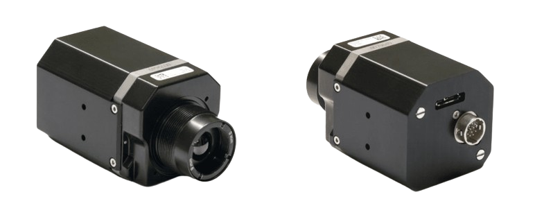

# Tau2_USB3_python_interface
This is a Python interface of the WIC SDK for the USB3 Tau2 module. 

## 💻 Materials
The USB3 Tau2 from Workswell was used to test this library. The main core used in this work has a resolution of 336x256 pixels.

     

## 🔧 Dependencies and Installation 
* Python == 3.8.0
* opencv-python == 4.10.0.84
* numpy == 1.24.4
* matplotlib == 3.7.5
 
## 🚀 Code
The project was tested on a Ubuntu laptop. Please, take into account that the WIC SDK version used in this work is 1.2.1, you can get it from the manufacturer's webpage. Follow their guidelines to ensure the correct installation of the necessary libraries. 

## 📜 License
This project is released under the MIT 2.0 license.

## 📧 Contact
If you have any questions, please email antoniogalvanhernandez1998@gmail.com.

